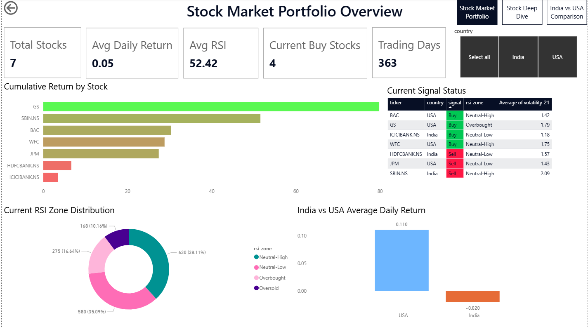
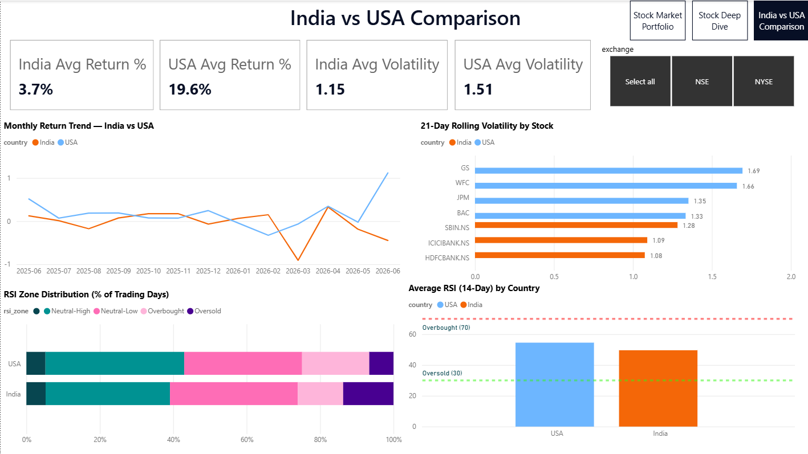

# 📈 Automated Stock Market ETL & Analytics Pipeline

## Project Overview

This project is an end-to-end Stock Market Analytics Pipeline that automatically extracts, transforms, stores, and visualizes stock market data for leading BFSI (Banking, Financial Services, and Insurance) stocks from India and the USA.

The solution demonstrates data engineering, SQL analytics, Power BI dashboarding, and automation concepts commonly used in enterprise reporting environments.

---

## Business Objective

The objective of this project is to:

* Automate daily stock market data collection
* Perform feature engineering and technical indicator calculations
* Store processed data in a structured database
* Enable interactive analytics through Power BI
* Compare BFSI stock performance across Indian and US markets
* Demonstrate production-style ETL automation

---

## Technology Stack

| Component       | Technology              |
| --------------- | ----------------------- |
| Data Extraction | Python, yFinance        |
| Data Processing | Pandas, NumPy           |
| Database        | SQLite                  |
| SQL Analysis    | SQLite SQL              |
| Dashboarding    | Power BI                |
| Automation      | Python Schedule Library |
| Version Control | Git & GitHub            |

---

## Architecture

Yahoo Finance API
↓
Phase 1 - Extractor
↓
Raw CSV Files
↓
Phase 2 - Transformer
↓
Feature Engineered Dataset
↓
Phase 3 - Loader
↓
SQLite Database
↓
SQL Analysis
↓
Power BI Dashboard
↓
Phase 6 - Automated Scheduler

---

## ETL Pipeline Workflow

### Phase 1 — Data Extraction

* Extracts daily stock market data using Yahoo Finance
* Covers BFSI stocks from India and USA
* Saves raw data into CSV format
* Generates extraction logs

### Phase 2 — Data Transformation

Performs feature engineering including:

* Daily Return %
* Moving Averages (7, 21, 50 Days)
* 21-Day Rolling Volatility
* RSI (14-Day)
* Price Range Metrics
* Volume Change %
* Cumulative Return %
* Buy/Sell Signal Generation
* RSI Zone Classification

### Phase 3 — Database Loading

* Loads transformed dataset into SQLite
* Refreshes data using truncate-and-reload strategy
* Maintains audit logging

### Phase 4 — SQL Analytics

SQL queries developed for:

* Top performers
* Volatility analysis
* RSI signal analysis
* Market comparison
* Price deviation studies
* BFSI sector insights

### Phase 6 — Automation

* Runs entire ETL pipeline automatically
* Scheduled daily at 06:00 AM
* Stops execution on failure
* Generates run status reports
* Maintains execution logs

---

## Power BI Dashboard

The dashboard contains three analytical pages.

### Page 1 — Portfolio Overview

Provides a high-level view of all tracked stocks.

Features:

* Latest Signal Status
* Current Buy Signals
* Average Volatility
* Stock Performance Summary
* Signal Distribution
* Portfolio Monitoring Table

---

### Page 2 — Stock Deep Dive

Allows detailed analysis of a selected stock.

dashboard/Stock Deep Dive.png

Features:

* Latest Close Price
* Cumulative Return %
* Average Daily Return
* Latest Volatility
* Price Trend with Moving Averages
* RSI Analysis
* Daily Return Distribution
* Volatility Trend
* Dynamic Buy/Sell Signal Indicator

---

### Page 3 — India vs USA Comparison

Compares BFSI stocks across markets.

Features:

* Average Market Returns
* Volatility Comparison
* Best Performing Stock
* Most Volatile Stock
* Monthly Return Trends
* RSI Zone Distribution
* Price vs Historical Average Analysis

---

## Project Structure

stock-market-etl-analytics-pipeline/

├── data/
│ ├── raw/
│ └── processed/
| └── database/
│
├── dashboard/
│ └── stock_market_dashboard.pbix
| └── Stock Market Portfolio Overview.png
| └── Stock Deep Dive.png
| └── India vs USA Comparision.png
|
│
├── sql/
│ └── phase4_queries.sql
│
├── logs/
│ └── .gitkeep
│
├── phase1_extractor.py
├── phase2_transformer.py
├── phase3_loader.py
├── phase6_automation.py
│
├── requirements.txt
├── pipeline_status.json
├── .gitignore
├── README.md
└── LICENSE

---

## Key Features

* Automated ETL Pipeline
* Technical Indicator Engineering
* SQL-Based Financial Analytics
* Interactive Power BI Dashboard
* Cross-Market BFSI Comparison
* Daily Automated Scheduling
* Logging & Monitoring
* Production-Style Data Refresh Process

---

## How to Run

### Install Dependencies

pip install -r requirements.txt

### Run Extraction

python phase1_extractor.py

### Run Transformation

python phase2_transformer.py

### Run Loading

python phase3_loader.py

### Run Full Automated Pipeline

python phase6_automation.py

---

## Sample Insights

* US BFSI stocks generated stronger cumulative returns over the analysis period.
* Indian BFSI stocks exhibited higher average volatility.
* RSI analysis identified periods of overbought and oversold market conditions.
* Moving Average crossover signals highlighted potential buy and sell opportunities.

---

## Skills Demonstrated

* Python Programming
* Data Engineering
* ETL Development
* SQL Querying
* Financial Analytics
* Power BI Dashboarding
* DAX Measures
* Data Visualization
* Automation & Scheduling
* GitHub Project Management

---

## Author

Shiva Kumar Devatha

Data Analyst | SQL Developer | Power BI Enthusiast

GitHub Portfolio Project – 2026
